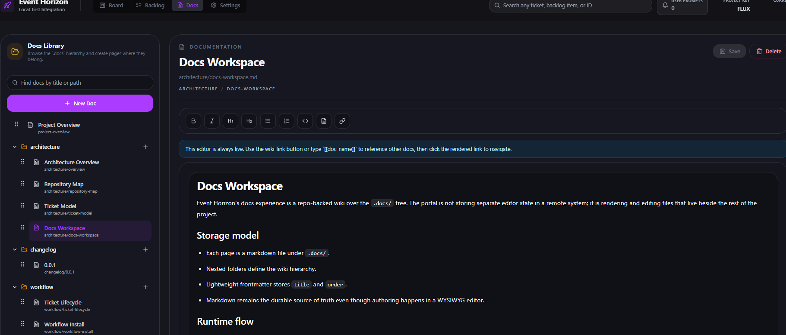

## Summary

Improve the docs screen layout by separating scroll contexts and condensing
the top-right section to maximize usable content space.

## Requirements

### 1. Independent scroll containers
- Docs sidebar hierarchy navigation and main doc content should scroll independently
- Scrolling the doc view should not affect the sidebar scroll position
- Scrolling the sidebar should not affect the doc view scroll position

### 2. Compact top-right section
- Reduce padding and margins in the top-right section of the docs view
- Keep all controls accessible but use space more efficiently
- Layout should still work well at different viewport sizes

## Acceptance Criteria

- [ ] Docs sidebar navigation scrolls independently from the main doc content
- [ ] Scrolling in the doc view does not affect sidebar scroll position
- [ ] Top right section has reduced padding/margins for a more compact layout
- [ ] Layout still works well at different viewport sizes

## Likely Affected Areas

- `portal/src/components/DocsScreen.tsx`
- `portal/src/components/DocsScreen.css` or equivalent styles

## Original Request
1. separate scrolling for the hierarchy navigation and the doc itself, scrolling in the doc shouldnt take us away from the left side navigation position
2. top section on right side is too bulky, we should condense it to be more space aware

