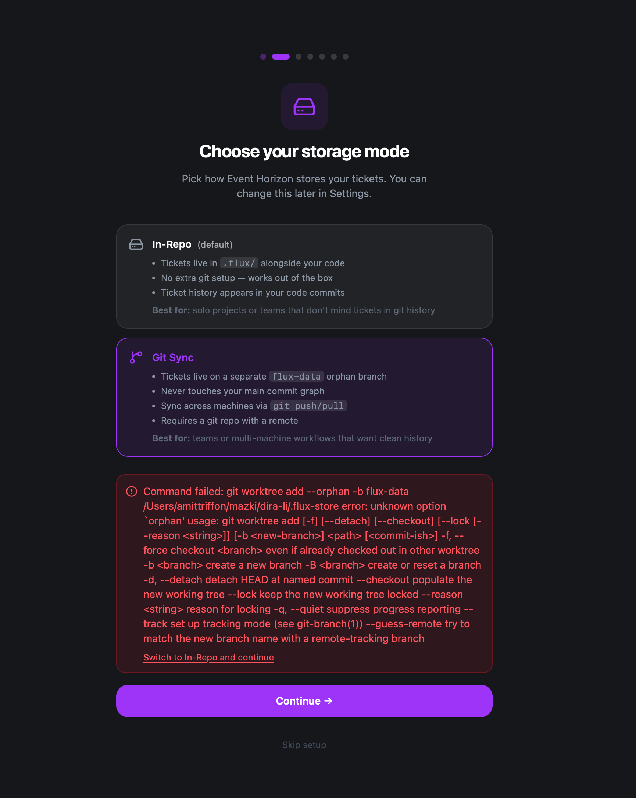

user reported this error  
maybe better to add a check for git version > 2.42

```
Your git version is older than 2.42 — that's when git worktree add --orphan was added.
```

and recommend to install it if not avbailable  


